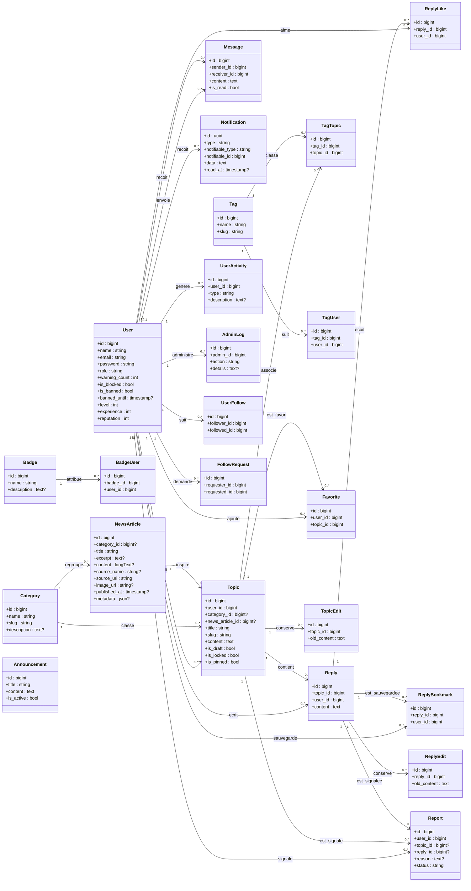

# Diagramme UML de la base de donnees

Ce schema se concentre sur les tables fonctionnelles du forum `Sphere`.
Les tables techniques Laravel (`cache`, `jobs`, `sessions`, `password_reset_tokens`) ne sont pas detaillees ici pour garder un diagramme lisible.

## Diagramme UML

## Lecture rapide

- `users` est la table centrale.
- `topics` represente les publications principales du forum.
- `replies` represente les reponses a un sujet.
- `messages` gere la messagerie privee entre utilisateurs.
- `notifications` gere les notifications Laravel.
- `news_articles` permet de lier une actualite a un sujet de reaction.
- les tables pivot (`tag_topic`, `tag_user`, `badge_user`, `user_follows`, `follow_requests`) gerent les relations plusieurs-a-plusieurs ou auto-relations.

## Tables pivot importantes

- `tag_topic` : association entre sujets et tags
- `tag_user` : tags suivis par un utilisateur
- `badge_user` : badges attribues aux utilisateurs
- `user_follows` : relation utilisateur -> utilisateur
- `follow_requests` : demande d'abonnement avant validation
- `reply_bookmarks` : reponses enregistrees

